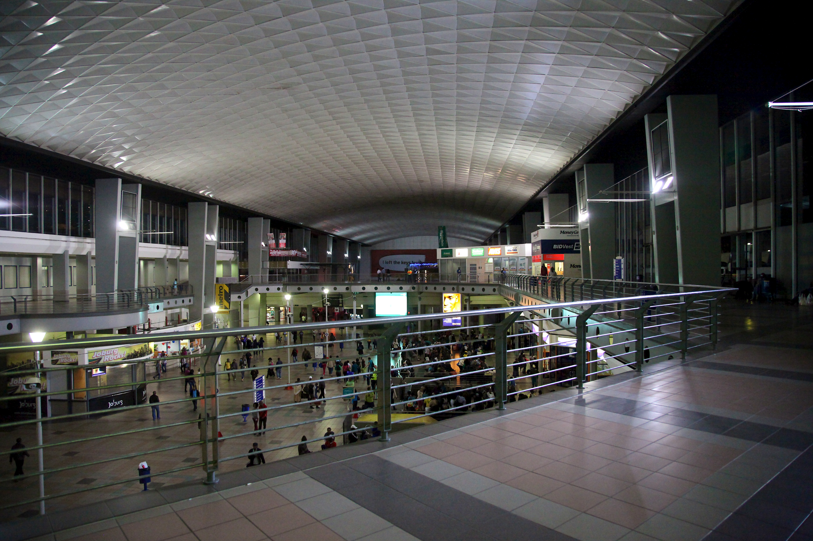
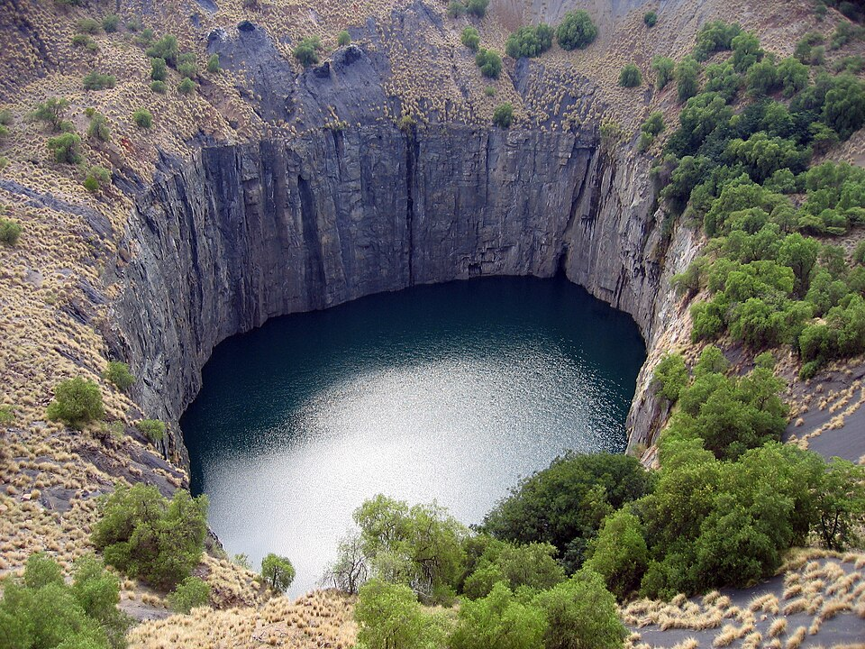
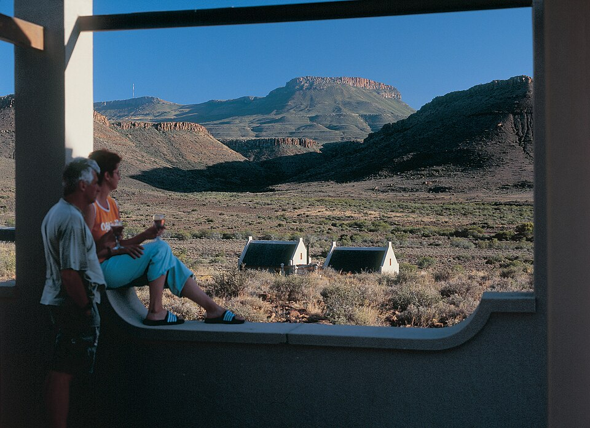
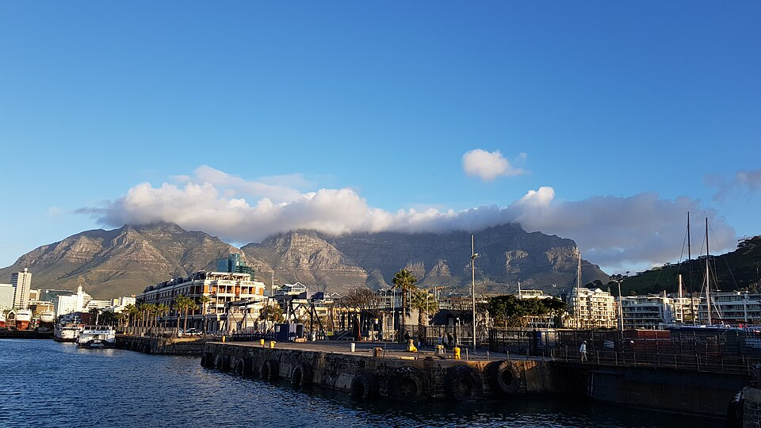
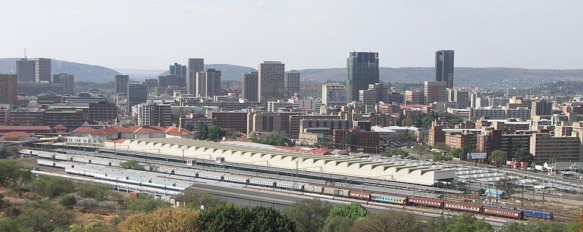

# Places along Lerato’s journey

> **Rails & Roots is a proposed interactive travel guide.** Leg 1 is an operating Gautrain journey from Pretoria to Gautrain Park Station. Lerato then changes to the separate Johannesburg Park Station context. Leg 2 uses a historical Shosholoza Meyl sequence as a simulation; there is no verified bookable Johannesburg–Cape Town train in this proposal.

The five featured places are Pretoria, Johannesburg, Kimberley, Beaufort West and Cape Town. Every other named place has its own researched JSON record. An attraction is a separately planned trip; a named historical railway stop does not imply that there is time or a service to get off and sightsee.

## Route order

| # | Place | Story or place to explore | Photo |
| --- | --- | --- | --- |
| 1 | [Johannesburg Park](../data/stops/johannesburg.json) | Featured story |  |
| 2 | [Krugersdorp](../data/stops/krugersdorp.json) | [Krugersdorp Museum](https://joburg.org.za/play_/Pages/Play%20in%20Joburg/Things%20to%20do/ATTRACTIONS/Krugersdorp-Museum.aspx) — Explore the local history displays at the Krugersdorp Museum. |  |
| 3 | [Potchefstroom](../data/stops/potchefstroom.json) | [NWU Botanical Garden](https://natural-sciences.nwu.ac.za/botanical-garden/home) — Visit the NWU Botanical Garden and explore its plants and garden displays. |  |
| 4 | [Klerksdorp](../data/stops/klerksdorp.json) | [Klerksdorp Museum](https://matlosana.gov.za/museum.html) — Explore the former prison and the museum’s cultural history exhibitions. |  |
| 5 | [Bloemhof](../data/stops/bloemhof.json) | [Bloemhof Dam Nature Reserve](https://ho.org.za/parks/bloemhof-dam-nature-reserve/) — Plan a birdwatching or nature visit to Bloemhof Dam Nature Reserve. |  |
| 6 | [Christiana](../data/stops/christiana.json) | [Diggers’ Diamond Museum](https://www.gov.za/speeches/vtsd-communities-encouraged-use-platforms-created-provincial-government-grow-their-economy) — Investigate the Diggers’ Diamond Museum and the town’s river history before arranging a visit. |  |
| 7 | [Warrenton](../data/stops/warrenton.json) | [Ditshoswane Community Art Centre](https://www.experiencenortherncape.com/experience-summer-differently-in-the-northern-cape/) — Discover local creative work at the Ditshoswane Community Art Centre, subject to current visitor arrangements. |  |
| 8 | [Kimberley](../data/stops/kimberley.json) | Featured story |  |
| 9 | [De Aar](../data/stops/de-aar.json) | [Garden of Remembrance](https://www.experiencenortherncape.com/cities-towns-and-neighbourhoods-3/de-aar/) — Explore the town’s Garden of Remembrance as part of a separately planned visit. |  |
| 10 | [Hutchinson](../data/stops/hutchinson.json) | [Victoria Trading Post and Mannetjies Roux Museum](https://www.experiencenortherncape.com/cities-towns-and-neighbourhoods-4/victoria-west/) — For a separately arranged trip, explore the Victoria Trading Post and Mannetjies Roux Museum in nearby Victoria West. |  |
| 11 | [Beaufort West](../data/stops/beaufort-west.json) | Featured story |  |
| 12 | [Laingsburg](../data/stops/laingsburg.json) | [Laingsburg Flood Museum](https://laingsburg.co.za/attractions/) — Visit the Flood Museum and learn about the flood route. |  |
| 13 | [Matjiesfontein](../data/stops/matjiesfontein.json) | [Matjiesfontein Railway Museum](https://www.matjiesfontein.com/pages/museums/) — Explore the Railway Museum and its former station master’s office and signal room. |  |
| 14 | [Worcester](../data/stops/worcester.json) | [Worcester Wine & Olive Route](https://visitwinelands.co.za/worcester-wine-olive-route/) — Research a tasting or food experience on the Worcester Wine & Olive Route. |  |
| 15 | [Wellington](../data/stops/wellington.json) | [Wellington Wine Route](https://visitwinelands.co.za/wellington-wine-route/) — Explore the Wellington Wine Route on a separately planned outing. | [.jpg)](https://commons.wikimedia.org/wiki/File:Wine_Estate_in_Wellington_-_Western_Cape,_South_Africa_(3880688103).jpg) |
| 16 | [Huguenot](../data/stops/huguenot.json) | [Afrikaans Language Museum and Monument](https://taalmuseum.co.za/en/visitors-information-language-museum/) — Plan a separate visit to the Afrikaans Language Museum or Monument in Paarl. |  |
| 17 | [Bellville](../data/stops/bellville.json) | [Tygerberg Nature Reserve](https://www.capetown.travel/neighbourhood/bellville/) — Explore Tygerberg Nature Reserve on a planned local visit. |  |
| 18 | [Cape Town](../data/stops/cape-town.json) | Featured story |  |

## Start of leg 1

| Place | Story | Photo |
| --- | --- | --- |
| [Pretoria Gautrain Station](../data/stops/pretoria.json) | Board Gautrain towards Park; check the operator’s current service information. |  |

## Image and research notes

- The linked supporting-stop images come from Wikimedia Commons. Image creator, licence and the exact file page are recorded in [the image credits](../assets/images/README.md) and each stop JSON. The featured photos are already in `assets/images/`.
- Hutchinson uses a clearly labelled image of **nearby Victoria West**; it must never be described as a photograph of Hutchinson. Its suggested visitor site also requires a separate onward road journey.
- Stations photographed years ago do not establish that a train calls there now. Opening hours, admission, accessible routes and travel from any station must be checked directly before a real visit.
- The historical station order comes from the [Competition Commission passenger transport inquiry](https://compcom.co.za/wp-content/uploads/2021/04/PTMI-Non-Confidential-14-April-2021-FINAL.pdf).
